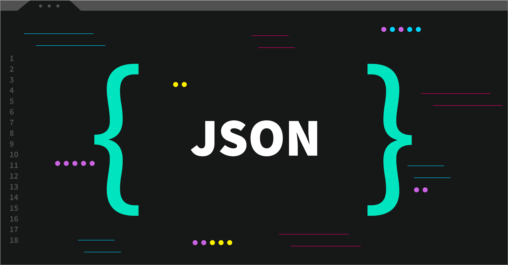

# Jason

[](https://gitmoji.dev)
[](https://opensource.org/licenses/MIT)


A simple [json](https://json.org) formmater.



## Installation

To be able to use it in your entire system you have to install globally:

```bash
npm i -g jason
```

If you use yarn:

```bash
yarn global add jason
```

## Usage

Now you can use it anywhere on your system:

```bash
jason config.json
```

By default, 2 tabs are used, but you can also specify how many tabs you want:

```bash
jason config.json 4
```

Jason is also a library, so you can also import it in your code.

Example using CommonJS:

```javascript
const jason = require('jason-formatter').default

const rawData = `
{

  "hey":9   ,
  "jason":true
}

`

console.log(jason(rawData, { tabs: 2 }))
```
